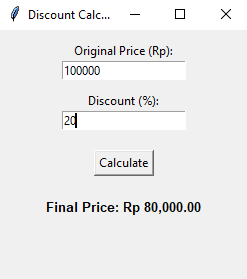

# Discount Calculator

A simple and efficient desktop application built with **Python** using the `Tkinter` library. This tool allows users to calculate the final price of an item after applying a percentage-based discount.

## Preview


## Features
* **Real-time Validation**: Handles empty inputs and non-numeric characters gracefully.
* **Logic Constraints**: Prevents negative prices and ensures discounts stay between 0% and 100%.
* **Currency Formatting**: Automatically formats the result in Rupiah (Rp) with thousand separators and two decimal places.
* **User-Friendly UI**: A clean, centered layout for easy navigation.

## Requirements
* **Python 3.x**
* **Tkinter** (Standard library included with most Python installations)

## Getting Started
1. **Clone or Copy** the code into a file named `calculator.py`.
2. **Run the script** using your terminal or command prompt:
   ```bash
   python calculator.py
   ```
